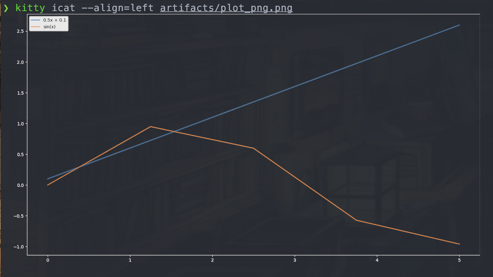
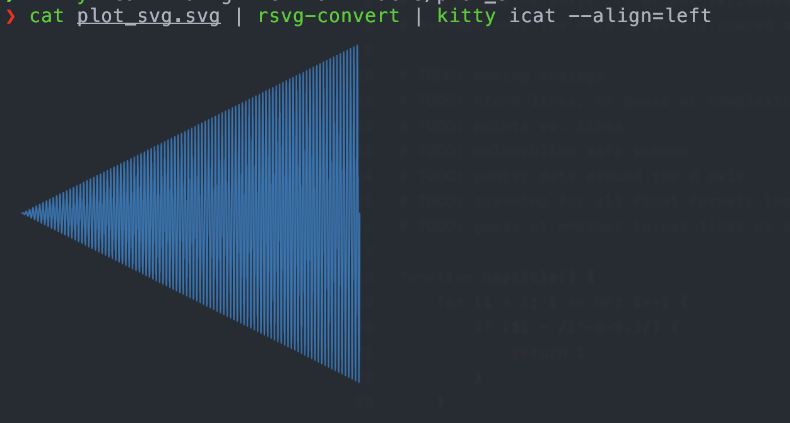
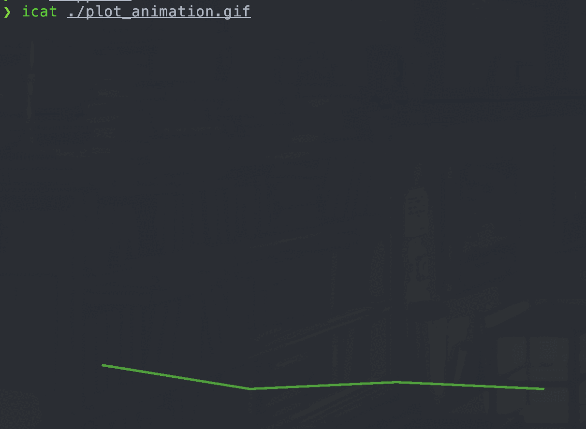

# Visualize stuff in terminal

This repo contains example snippets of visualization in the terminal.  
It's for my forgetting mind, so some of the examples contain unnecessary stuff just so I can use them without thinking in my processes :)  
It requires Kitty terminal as well as rsvg-convert.  

## Handy aliases

```
alias icat="kitty icat --align=left"
alias isvg="rsvg-convert | icat"

```

## Examples:

All examples are available in *examples* directory.  

**plot_png**

Snippet with matplotlib, saving into png format.  
It demonstrates the parameters to set to get *good* colors and sizes, default ones are not ideal for terminal.  
If you want even simpler example and don't care about axis and want just content of plot, look at **plot_svg** - it doesn't have them, the same can be saved as png.  

```
# generate png
python plot_png.py
# print in terminal
kitty icat --align=left plot_png.png
```

Result:  
</img>

**plot_svg**

Simple snippet with matplotlib, saving into svg format.  The plot is generated without axis, if you want details on how to handle axis, labels and stuff see **plot_png** - the same parameters apply to svg (I didn't check though).  
>> this svg file is actually converted to png by *rsvg-convert* below, this example is just to illustrate how to export to svg.  

```
# generate svg
python plot_svg.py
# print in terminal
cat plot_svg.svg | rsvg-convert | kitty icat --align=left 
```

Result:  
</img>

**plot_animation**

Simple snippet with matplotlib, saves animated plot into gif format.  

```
# generate gif
python plot_animation.py
# print in terminal
kitty icat --align=left plot_animation.gif
```

Result:  
</img>
